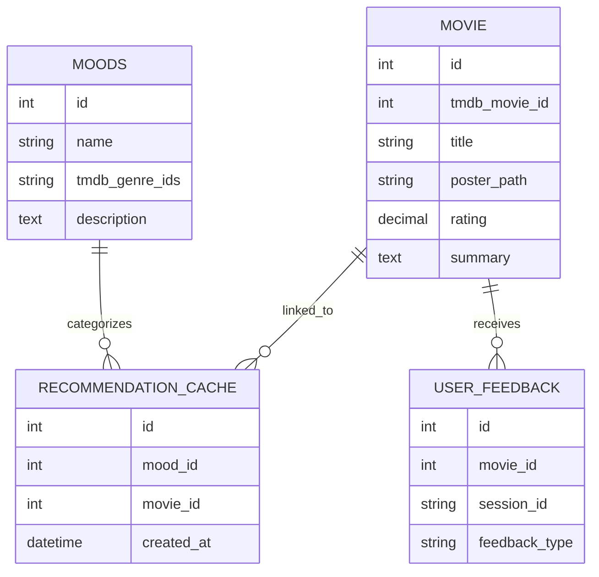

---

# MoodMovie

## Technical Design Documentation

MoodMovie is a mood-based movie recommendation system that blends emotional intent, normalized relational modeling, cached third-party data, and session-aware user feedback to deliver lightweight yet adaptive recommendations.

---

## Contents

* [Database Schema Overview](#database-schema-overview)
* [Entity Definitions](#entity-definitions)

  * [Moods](#moods)
  * [Movie](#movie)
  * [RecommendationCache](#recommendationcache)
  * [UserFeedback](#userfeedback)
* [Relationship Logic](#relationship-logic)
* [Core System Logic: The Smart Randomizer](#core-system-logic-the-smart-randomizer)
* [API Endpoints](#api-endpoints)
* [Visual & Logical Model](#visual--logical-model)

---

## Database Schema Overview

The MoodMovie backend is built on a **normalized relational database model** designed for scalability, data integrity, and high performance.

The system supports:

* Mood-based filtering
* Efficient TMDb API result caching
* Many-to-Many mood-to-movie associations
* Session-scoped user feedback
* Adaptive recommendation refinement

By decoupling movie metadata from mood associations, the architecture ensures:

* Elimination of redundant movie records
* Strong referential integrity
* Flexible querying
* Efficient cache lifecycle management

The schema comprises four primary entities:

* `Moods`
* `Movie`
* `RecommendationCache`
* `UserFeedback`

Each entity plays a distinct role in the recommendation lifecycle.

---

## Entity Definitions

### Moods

**Purpose**
Stores the mapping logic between emotional states and TMDb API parameters.

| Attribute      | Type         | Constraints        | Description                                     |
| -------------- | ------------ | ------------------ | ----------------------------------------------- |
| id             | Integer      | PK, Auto-increment | Unique identifier for each mood                 |
| name           | Varchar(50)  | Not Null           | User-facing label (e.g., *Thought-Provoking*)   |
| tmdb_genre_ids | Varchar(100) | Not Null           | Comma-separated IDs used to filter the TMDb API |
| description    | Text         | Optional           | Internal notes describing the mood              |

---

### Movie

**Purpose**
Acts as the central **Source of Truth** for movie metadata.

| Attribute     | Type         | Constraints        | Description                       |
| ------------- | ------------ | ------------------ | --------------------------------- |
| id            | Integer      | PK, Auto-increment | Unique internal identifier        |
| tmdb_movie_id | Integer      | Unique, Indexed    | Reference ID from TMDb            |
| title         | Varchar(255) | Not Null           | Official movie title              |
| poster_path   | Varchar(255) | Optional           | Relative URL for the movie poster |
| rating        | Decimal(3,1) | Default: 0.0       | Average user score from TMDb      |
| summary       | Text         | Optional           | Brief, spoiler-free overview      |

---

### RecommendationCache

**Purpose**
Manages the **Many-to-Many relationship** between `Moods` and `Movie`.

This table acts as a junction table while also enabling cache lifecycle tracking.

| Attribute  | Type     | Constraints        | Description                    |
| ---------- | -------- | ------------------ | ------------------------------ |
| id         | Integer  | PK, Auto-increment | Unique cache record identifier |
| mood_id    | Integer  | FK → Moods.id      | Associated mood category       |
| movie_id   | Integer  | FK → Movie.id      | Linked movie record            |
| created_at | DateTime | Auto-now-add       | Timestamp for cache management |

---

### UserFeedback

**Purpose**
Captures session-based user sentiment to dynamically refine recommendations.

| Attribute     | Type         | Constraints        | Description                           |
| ------------- | ------------ | ------------------ | ------------------------------------- |
| id            | Integer      | PK, Auto-increment | Feedback entry identifier             |
| movie_id      | Integer      | FK → Movie.id      | Movie receiving feedback              |
| session_id    | Varchar(255) | Not Null           | Unique user session identifier        |
| feedback_type | Varchar(10)  | Choices/Enum       | Restricted to `Good`, `Bad`, or `Meh` |

---

## Relationship Logic

### Moods ↔ Movie

**Many-to-Many** (via RecommendationCache)

A single movie may belong to multiple moods (e.g., *Spider-Man* categorized as both *High Energy* and *Adventure*).

This prevents metadata duplication while allowing emotional flexibility in classification.

---

### Movie → UserFeedback

**One-to-Many**

A single movie can accumulate feedback from many unique sessions.

This enables session-aware filtering while preserving global movie integrity.

---

## Core System Logic: The Smart Randomizer

The backend recommendation engine follows a deterministic yet flexible pipeline:

1. **Mood Selection**
   The user selects a `mood_id`.

2. **Lookup Phase**
   The system retrieves all `movie_id` entries associated with the selected mood via `RecommendationCache`.

3. **Session-Based Filtration**
   A join with `UserFeedback` excludes any movie where the current `session_id` has recorded `Bad` feedback.

4. **Randomized Selection**
   A movie is randomly selected from the remaining candidate pool.

5. **Frontend Delivery**
   The result is returned to the client application for rendering.

This architecture balances:

* Randomness
* Personalization
* Data integrity
* Performance efficiency

---

## API Endpoints

### Retrieve Available Moods

**GET /api/moods/**

Returns all available moods with descriptions and metadata.

---

### Retrieve Recommendations

**GET /api/recommend/?mood_id=X**

Returns one or more movies associated with the selected mood, excluding session-specific `Bad` feedback.

---

### Submit User Feedback

**POST /api/feedback/**

Stores user sentiment (`Good`, `Bad`, `Meh`) for a given movie and session.

Enforced via a unique-together constraint on (`movie_id`, `session_id`) to prevent duplicate submissions within the same session.

---

## Visual & Logical Model

Entity relationships follow **Crow’s Foot notation**, enforcing referential integrity through:

* `RecommendationCache.mood_id`
* `RecommendationCache.movie_id`
* `UserFeedback.movie_id`

### ER Diagram (Mermaid)

---
